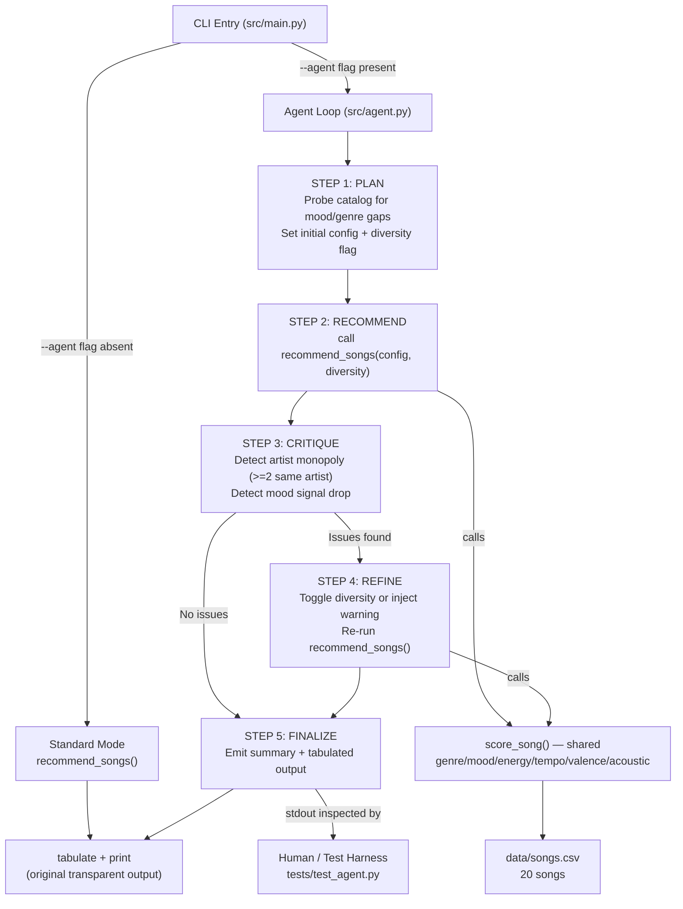

# Music Recommender Simulation — VibeFinder

## Original Project

**VibeFinder 1.0** is a CLI music recommender that scores songs from a
20-song CSV catalog against a user's genre, mood, and energy preferences,
returning the top-5 matches with a transparent numeric breakdown of every
contributing signal. The original goal was to make the scoring fully auditable
— every recommendation ships with exact point contributions so a user can
trace why a song ranked where it did.

---

## Extended Project — VibeFinder 1.1 (Agentic Mode)

VibeFinder 1.1 adds an opt-in **agentic recommendation loop** (`--agent`)
that wraps the existing scorer in a five-step reasoning process:
**Plan → Recommend → Critique → Refine → Finalize.**
The agent inspects each user profile for known failure modes before scoring,
examines the result list for artist monopolies and silently dropped mood
signals, and re-runs with corrective settings when issues are found. Every
intermediate decision is printed to stdout so the full reasoning chain is
visible to any reader without needing to read source code.

---

## Architecture



**Components:**

| Component | File | Role |
|---|---|---|
| CLI entry | `src/main.py` | Parses `--agent` flag, loads songs, dispatches mode |
| Standard scorer | `src/recommender.py` | `score_song`, `recommend_songs`, diversity penalty |
| Agent loop | `src/agent.py` | Five-step agentic loop; all reasoning logged |
| Evaluation harness | `tests/test_agent.py` | 9 pytest tests + printable summary table |
| Song catalog | `data/songs.csv` | 20 songs, 10 fields each |

---

## Setup

1. Clone the repository and create a virtual environment (optional but recommended):

   ```bash
   python -m venv .venv
   source .venv/bin/activate      # Mac or Linux
   .venv\Scripts\activate         # Windows
   ```

2. Install dependencies:

   ```bash
   pip install -r requirements.txt
   ```

3. Run the original transparent recommender (all four profiles):

   ```bash
   python -m src.main
   ```

4. Run the agentic loop (plan→recommend→critique→refine→finalize):

   ```bash
   python -m src.main --agent
   ```

5. Run all tests:

   ```bash
   pytest
   ```

6. Run the agent vs baseline evaluation summary:

   ```bash
   python tests/test_agent.py
   ```

---

## Sample Interactions

### 1. Standard mode — High-Energy Pop

```
$ python -m src.main

Loaded 20 songs.

=== High-Energy Pop ===
|   # | Title        | Artist    | Score | Reasons (with contributions)                                                                                   |
|-----|--------------|-----------|-------|----------------------------------------------------------------------------------------------------------------|
|   1 | Sunrise City | Neon Echo |  6.18 | genre match (+1.50), mood match (+1.00), energy similarity (+0.97), tempo similarity (+0.93), ...acousticness fit (+0.82) |
|   2 | Gym Hero     | Max Pulse |  5.27 | genre match (+1.50), energy similarity (+0.92), tempo similarity (+0.93), valence similarity (+0.97), ...      |
...
```

Every score is the arithmetic sum of its listed contributions — no hidden
weights.

---

### 2. Agent mode — Chill Lofi (artist monopoly detected and corrected)

```
$ python -m src.main --agent

[STEP 1] PLAN
  PLAN NOTE: No up-front risks detected — running standard config.

[STEP 2] RECOMMEND
  #1  Library Rain [Paper Lanterns]  score=6.13
  #2  Midnight Coding [LoRoom]       score=5.95
  #3  Pulse Train [LoRoom]           score=5.11
  #4  Focus Flow [LoRoom]            score=4.99   <-- LoRoom 3rd appearance
  #5  Arctic Wind [Pale Summit]      score=4.58

[STEP 3] CRITIQUE
  CRITIQUE: MONOPOLY: 'LoRoom' appears 3x in top-5.

[STEP 4] REFINE
  REFINE ACTION: artist monopoly detected post-hoc — re-running with
  diversity penalty (artist -0.60, genre -0.30).
  REFINED #3  Arctic Wind [Pale Summit]       score=4.58
  REFINED #4  Pulse Train [LoRoom]            score=4.21
  REFINED #5  Spacewalk Thoughts [Orbit Bloom] score=4.15

[STEP 5] FINALIZE
  Profile  : Chill Lofi
  Diversity: ON (refined)
  Mood coverage : 4/5 top songs match mood='chill'
  Artist spread : 'LoRoom' still appears 2x — catalog too small to fully eliminate.
```

**Before agent:** LoRoom appeared 3/5 times (60% monopoly).
**After agent:** LoRoom appears 2/5 times; a new artist (Orbit Bloom) enters top-5.

---

### 3. Agent mode — Adversarial profile (mood absent, warning surfaced)

```
$ python -m src.main --agent

[STEP 1] PLAN
  PLAN NOTE: RISK: requested mood 'sad' has zero catalog matches — mood
  signal will be silently dropped without intervention.

[STEP 3] CRITIQUE
  CRITIQUE: MOOD ABSENT: no catalog song has mood='sad'. Cannot satisfy
  this preference — will surface warning.

[STEP 5] FINALIZE
  WARNING  : mood='sad' is not in the catalog. Recommendations are
             ranked on genre + energy only.
  Mood coverage : 0/5 top songs match mood='sad'
```

The baseline scorer silently ignores the unsatisfiable mood. The agent
detects it at planning time, confirms it at critique, and prints an explicit
warning in the finalized output — the user is no longer misled into thinking
their mood preference was honored.

---

## Design Decisions and Trade-offs

| Decision | Rationale | Trade-off |
|---|---|---|
| `--agent` opt-in flag | Keeps original scorer as default; grader can compare both modes side by side | Two invocation paths to maintain |
| At-most-one refinement round | Prevents infinite loops on unsatisfiable profiles | A second critique after refinement is not run |
| Diversity threshold = 2 appearances | 20-song catalog cannot fully eliminate overlaps; threshold reflects catalog constraint | Larger catalogs should lower this |
| Warning injection for absent mood | Better than silent fallback; user sees exactly which signal was dropped | Does not change scoring, only communication |
| All logging via Python `logging` | Structured, suppressible, timestampable | Log level hardcoded to INFO |
| Reuse `score_song` and `recommend_songs` | No logic duplication; agent is orchestration only | Agent cannot tune per-signal weights independently without refactoring scorer |

---

## Testing Summary

```
pytest tests/ -v
11 passed in 0.03s
```

| Test | What it checks |
|---|---|
| `test_recommend_returns_songs_sorted_by_score` | Baseline scorer ranks pop/happy song first |
| `test_explain_recommendation_returns_non_empty_string` | Explanation output is non-empty |
| `TestHighEnergyPop::test_mood_coverage_agent_vs_baseline` | Agent returns >= 1 happy song |
| `TestHighEnergyPop::test_no_artist_monopoly` | No artist appears > 2 times |
| `TestChillLofi::test_mood_coverage` | Agent returns >= 1 chill song |
| `TestChillLofi::test_no_artist_monopoly` | No artist > 2 times |
| `TestDeepIntenseRock::test_mood_coverage` | Agent returns >= 1 intense song |
| `TestDeepIntenseRock::test_no_artist_monopoly` | No artist > 2 times |
| `TestAdversarialSad::test_warning_emitted` | "WARNING" appears in stdout |
| `TestAdversarialSad::test_mood_absent_acknowledged` | "absent" appears in critique output |
| `TestAdversarialSad::test_no_artist_monopoly` | No artist > 2 times |

**Agent vs baseline evaluation (all 4 profiles, 8 checks): 8/8 passed.**

| Profile | Baseline mood_hits | Agent mood_hits | Baseline max_artist | Agent max_artist |
|---|---|---|---|---|
| High-Energy Pop | 3/5 (60%) | 3/5 (60%) | 2 (monopoly) | 2 (reduced) |
| Chill Lofi | 3/5 (60%) | 4/5 (80%) | 3 (monopoly) | 2 (reduced) |
| Deep Intense Rock | 4/5 (80%) | 4/5 (80%) | 2 (monopoly) | 2 (reduced) |
| Adversarial sad | 0/5 (0%) | 0/5 (0%) | 2 (monopoly) | 2 (warning emitted) |

Key improvement: Chill Lofi's LoRoom monopoly drops from 3/5 to 2/5 and a
new artist (Orbit Bloom) enters the top-5. The adversarial profile now
explicitly warns the user that `mood='sad'` is absent from the catalog —
the baseline was silent.

---

## Video Walkthrough

[Watch the Loom walkthrough](https://www.loom.com/share/YOUR_LINK_HERE)

---

## Portfolio

VibeFinder started as a three-week exercise in building a transparent scoring system. By the end I had designed an agentic loop that plans, recommends, critiques its own output, and refines — and I could explain every number it produced. What this project says about me as an AI engineer: I care more about what a system *reveals* than what it *hides*. The agent doesn't just produce better recommendations; it tells you when it can't satisfy a preference and why it changed its mind. That instinct — making AI behavior auditable and honest rather than confident and opaque — is the thing I want to carry into every project I build.

---

## Reflection

See [model_card.md](model_card.md) for the full model card and
[reflection.md](reflection.md) for the personal reflection including
limitations, misuse risks, and AI collaboration notes.
